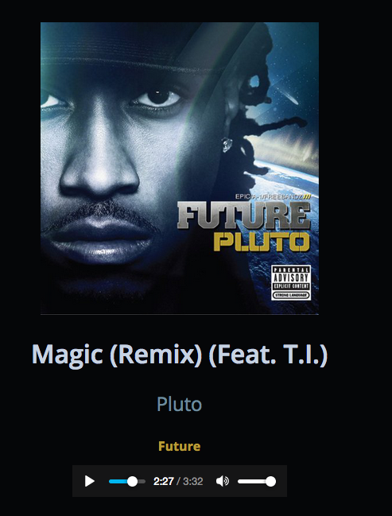

# PLEX #NowPlaying


PLEX #NowPlaying (PlexNP) is a simple node.js app that allows you to share a saved state of your currently open Plex Media Session.

The Workflow is something along the lines up

1. You're listening to music or watching a movie
2. You Pull up PlexNP, and choose a state to save and share
3. This State is saved under a unique hash, which can be shared depending on hosting parameters
4. Profit


## Install
```
npm install
```

- you need to configure `config.json` with your Plex Token, and other attributes you want to show in the OG Graph XNL

```
npm start
````

Deploy via PM2 for production.

## To-Do
- [ ] Continue updating README
- [ ] Create PM2 release branch
- [ ] Create Proxy Layer
- [ ] Create Config Layer
- [ ] Create Debug Layer
- [ ] "Templatize" the client/render on server
- [ ] Smmother, Smaller Client

## Future
- [ ] Playlists
- [ ] Full Minimal Library View for "what do you listen to? type questions"
- [ ] Album Mode

## Dev Notes

### API

Full - http://10.0.0.173:32400/library/metadata/9516/thumb/1518149414?X-Plex-Token=vYF5nUQcaTYNXsvU19EM

Sessions- http://10.0.0.173:32400/status/sessions?X-Plex-Token=vYF5nUQcaTYNXsvU19EM

Transcoded - http://10.0.0.173:32400/photo/:/transcode?url=http%3A%2F%2F10.0.0.173%3A32400%2Flibrary%2Fmetadata%2F9516%2Fthumb%2F1518149414%3F&width=148&height=156&X-Plex-Token=vYF5nUQcaTYNXsvU19EM

URL Encoder - https://www.urlencoder.org/

## More Info
- https://support.plex.tv/articles/204059436-finding-an-authentication-token-x-plex-token/
- https://support.plex.tv/articles/categories/plex-media-server/using-plex-web-app/
- https://github.com/Arcanemagus/plex-api/wiki/Plex-Web-API-Overview
- https://github.com/Arcanemagus/plex-api/wiki/Playback-Control